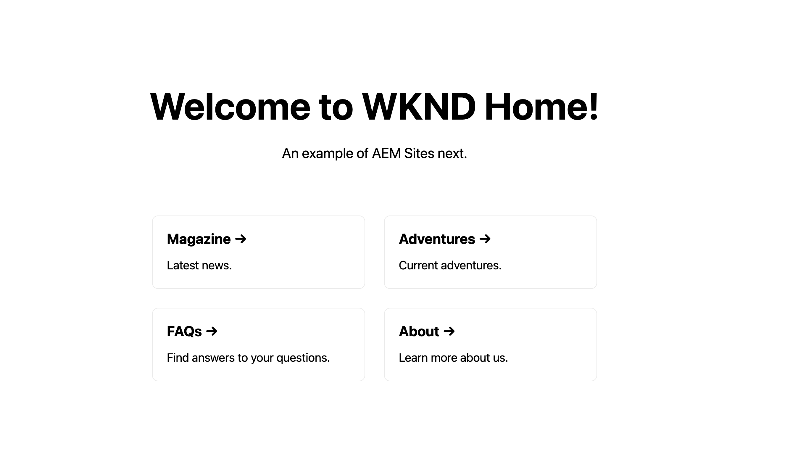

# Sample app of WKND in NextJS

This app demonstrates how to write a simple app rendering AEM Content fragments in Next JS.



## Local development

```bash
npm install
npm run dev
```

## Production mode

Copy `.env.development` to `.env`. If you have an AEM publish instance, put in as the AEM host.

```bash
npm run build
npm run start
```

## References

AEM React components in courtesy of https://github.com/sharanyavinod/nextjs-sample-app/.